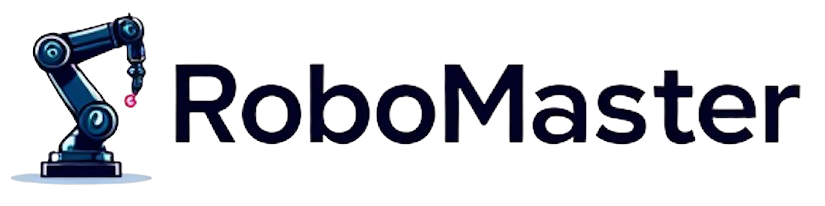

## ___***Learning Video Generation for Robotic Manipulation with Collaborative Trajectory Control***___
<div align="center">
</img>

 &nbsp;
 <a href='http://fuxiao0719.github.io/projects/robomaster'></a> &nbsp;
 <a href='https://drive.google.com/file/d/1GSfB3UbrUtJvgHkNrzm4TwLjqdR6H0-n/view'></a> &nbsp;
 <a href='https://huggingface.co/KwaiVGI/RoboMaster'></a> &nbsp;

**[Xiao Fu<sup>1 &dagger;</sup>](https://fuxiao0719.github.io/), 
[Xintao Wang<sup>2 &#9993;</sup>](https://xinntao.github.io/), 
[Xian Liu<sup>1</sup>](https://alvinliu0.github.io/), 
[Jianhong Bai<sup>3</sup>](https://jianhongbai.github.io/), 
[Runsen Xu<sup>1</sup>](https://runsenxu.com/), <br>
[Pengfei Wan<sup>2</sup>](https://scholar.google.com/citations?user=P6MraaYAAAAJ&hl=en),
[Di Zhang<sup>2</sup>](https://openreview.net/profile?id=~Di_ZHANG3),
[Dahua Lin<sup>1&#9993;</sup>](http://dahua.site/)** 
<br>
<sup>1</sup>The Chinese University of Hong Kong
<sup>2</sup>Kuaishou Technology
<sup>3</sup>Zhejiang University
<br>
&dagger;: Intern at KwaiVGI, Kuaishou Technology, &#9993;: Corresponding Authors

</div>

## 🌟 Introduction

🔥 RoboMaster synthesizes realistic robotic manipulation video given an initial frame, a prompt, a user-defined object mask, and a collaborative trajectory describing the motion of both robotic arm and manipulated object in decomposed interaction phases. It supports diverse manipulation skills and can generalize to in-the-wild scenarios.

https://github.com/user-attachments/assets/02fa2491-ac09-4bc0-bf57-955192f37755

### 📝 TODO List
- [x] Add inference codes with checkpoints.
- [x] Add training codes.
- [x] Add evaluation codes.
- [ ] Add Gradio demo to generate model inputs on in-the-wild images.
- [ ] Release full training data.

## ⚙️ Quick Start

### 1. Environment Setup

1. Our environment setup is identical to [CogVideoX](https://github.com/THUDM/CogVideo). You can refer to their configuration to complete the environment setup.
    ```bash
    conda create -n robomaster python=3.10
    conda activate robomaster
    ```
2. Download `ckpts` from [here](https://huggingface.co/KwaiVGI/RoboMaster/tree/main) and place it under the base root `RoboMaster`. The checkpoints are organized as follows:
    ```
    ├── ckpts
        ├── CogVideoX-Fun-V1.5-5b-InP   (pretrained model base)
        ├── RoboMaster                  (post-trained transformer)
    ```

### 2. Generate Website Demos

1. Robotic Manipulation on Diverse Out-of-Domain Objects.
    ```bash
    python inference_inthewild.py \
        --input_path demos/diverse_ood_objs \
        --output_path samples/infer_diverse_ood_objs \
        --transformer_path ckpts/RoboMaster \
        --model_path ckpts/CogVideoX-Fun-V1.5-5b-InP
    ```

2. Robotic Manipulation with Diverse Skills
    ```bash
    python inference_inthewild.py \
        --input_path demos/diverse_skills \
        --output_path samples/infer_diverse_skills \
        --transformer_path ckpts/RoboMaster \
        --model_path ckpts/CogVideoX-Fun-V1.5-5b-InP
    ```

3. Long Video Generation in Auto-Regressive Manner
    ```bash
    python inference_inthewild.py \
        --input_path demos/long_video \
        --output_path samples/long_video \
        --transformer_path ckpts/RoboMaster \
        --model_path ckpts/CogVideoX-Fun-V1.5-5b-InP
    ```

### 3. Start Training
1. We fine-tune the base model on videos with a resolution of 640×480 and 37 frames using 8 GPUs. During preprocessing, videos with fewer than 16 frames are excluded.
    ```bash
    cd scripts
    bash train_injector.sh
    ```
    
## 🚀 Benchmark Evaluation
  ```
├── RoboMaster
    ├── eval_metrics
        ├── VBench
        ├── common_metrics_on_video_quality
        ├── eval_traj
        ├── results
            ├── bridge_eval_gt
            ├── bridge_eval_ours
            ├── bridge_eval_ours_tracking
  ```
### 1.  Prepare Evaluation Files & Inference on Benchmark
1. Download `eval_metrics.zip` from [here](https://huggingface.co/KwaiVGI/RoboMaster/tree/main) and extract it under the base root.

2. Generating `bridge_eval_ours`. (Note that the results may vary slightly across different computing machines, even with the same seed. We have prepared the reference files under `eval_metrics/results`)
    ```bash
    cd RoboMaster/
    python inference_eval.py
    ```
3. Generating `bridge_eval_ours_tracking`: Install [CoTracker3](https://github.com/facebookresearch/co-tracker), and then estimate tracking points with grid size 30 on `bridge_eval_ours`. 

### 2.  Evaluation on Visual Quality

1. Evaluation of VBench metrics.
    ```bash
    cd eval_metrics/VBench
    python evaluate.py \
        --dimension aesthetic_quality imaging_quality temporal_flickering motion_smoothness subject_consistency background_consistency \
        --videos_path ../results/bridge_eval_ours \
        --mode=custom_input \
        --output_path evaluation_results
    ```
2. Evaluation of FVD and FID metrics.
    ```bash
    cd eval_metrics/common_metrics_on_video_quality
    python calculate.py -v1_f ../results/bridge_eval_ours -v2_f ../results/bridge_eval_gt
    python -m pytorch_fid eval_1 eval_2
    ```

### 3.  Evaluation on Trajectory (Robotic Arm & Manipulated Object)

1. Estimation of TrajError metrics. (Note that we exclude some samples listed in `failed_track.txt`, due to failed estimation by [CoTracker3](https://github.com/facebookresearch/co-tracker))
    ```bash
    cd eval_metrics/eval_traj
    python calculate_traj.py \
        --input_path_1 ../results/bridge_eval_ours \
        --input_path_2 ../results/bridge_eval_gt \
        --tracking_path ../results/bridge_eval_ours_tracking \
        --output_path evaluation_results
    ```
2. Check the visualization videos under `evaluation_results`. We blend the trajectories of robotic arm and object throughout the entire video for better illustration.

####

## 🔗 Citation
If you find this work helpful, please consider citing:
```BibTeXw
@article{fu2025robomaster,
  title={Learning Video Generation for Robotic Manipulation with Collaborative Trajectory Control},
  author={Fu, Xiao and Wang, Xintao and Liu, Xian and Bai, Jianhong and Xu, Runsen and Wan, Pengfei and Zhang, Di and Lin, Dahua},
  journal={arXiv preprint arXiv:2506.XXXXX},
  year={2025}
}
```
